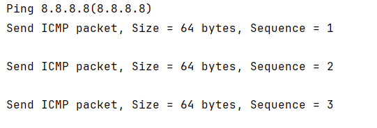

# ✉️ Unix/Linux Ping Tool
Кросплатформенная утилита для проверки сетевого соединения
и получения MAC-адресов устройств в сети, с использованием
raw sockets.

## ⭐️ Особенности
- Современный C++20 с CMake
- POSIX API
- Raw ICMP sockets с ручной сборкой пакетов
- Получение MAC-адреса через /proc/net/arp и команду arp
- Автоматическое разрешение доменных имён в IP-адреса
- Поддержка WSL и нативного Linux
  
  ### ⚠️ Важное требование
    Программа запускается только под root правами

## 🚀 Быстрый старт
  ### Требования
  - Unix/Linux система или WSL
  - CMake 3.31+
  - Компилятор с поддержкой C++20
  - root права

  ### Автоматические проверки
  CMake автоматически проверяет наличие необходимых includes:

    sys/socket.h
    netinet/ip.h
    netinet/ic_icmp.h

  ### Сборка
  ```bash
  git clone git@github.com:aLWMoRo/NDM_test__unix.git
  cd NDM_test__unix
  ```
  ```
  mkdir build && cd build
  cmake ..
  make
  ```
  ### Установка
  ```
  sudo make install
  ```


## 📋 Использование
  ### Ping по Ip-адресу
      ./NDM_test__unix 8.8.8.8
  
  ### Ping по доменному имени
      ./NDM_test__unix google.com
  
  ### Ping локального устройства
      ./NDM_test__unix localhost

### Пример вывода



## 🛠 Технические детали
- Язык: C++20
- Система сборки: CMake
- Сетевой уровень: Raw ICMP sockets (IPPROTO_ICMP)
- Mac-адреса: /proc/net/arp + fallback на команду arp
- Архитектура: Объектно-ориентированная с RAII


## 🗂 Структура проекта
```
NDM_test__unix/
  ├── CMakeLists.txt        # Конфигурация CMake
  ├── main.h                # Header файл
  ├── main.cpp              # Основная логика приложения
  └── README                # Документация
```


## 🔧 Особенности реализации
  ### Сетевая часть
  - Ручная сборка ICMP-пакетов с вычислением checksum
  - Использование raw sockets для полного контроля над пакетами
  - Timeout на операции receive с обработкой EAGAIN/EWOULDBLOCK

  ### MAC-адреса
  - Первичный метод: /proc/net/arp
  - Резервный метод: выполнение команды arp -n
  - Валидация и форматирование MAC-адресов

  ### Безопасность
  - Обработка сигнала SIGINT для корректного завершения
  - Проверка привилегий с информативными сообщениями об ошибках
  - Exception-safe код с RAII


## Возможные проблемы
  ### Permission denied
  Решение
  ```
  sudo ./NDM_test__unix <ip address/Domain name>
  ```

  ### Socket() failed
  - Убедитесь, что у вас есть root права
  - Проверьте, что система поддерживает raw sockets

  ### MAC address not found
  - Целевой хост может быть недоступен в локальной сети
  - ARP-таблица может быть пустой для удалённых хостов


## WSL Compatibility
Полностью совместим с Windows Systems for Linux:
  ```bash
  # В WSL
  sudo ./NDM_test__unix 8.8.8.8
  ```

## 📝 Лицензия
Проект создан исключительно в образовательных целях.